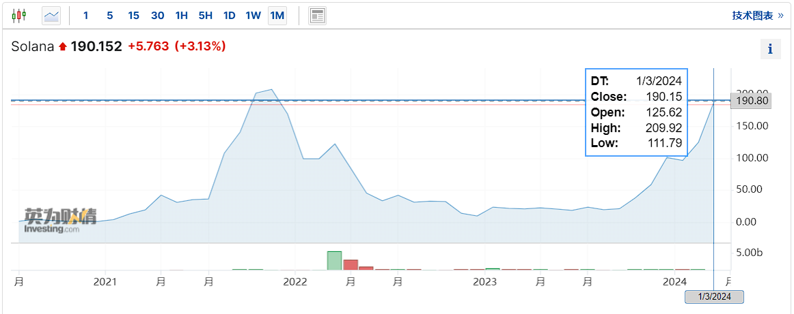

## 一、Solana的发展历程

​	“公链之王” Ethereum 是毋庸置疑的加密货币操作系统龙头，虽然它在安全性和去中心化方面表现出色，但它们在处理大规模交易时往往面临性能瓶颈和高昂的交易费用。不仅仅给用户带来了糟糕的体验，连使用 DeFi 应用都有着难以忍受的拥堵。

​	在此背景下，许多团队开始探索各种解决方案，包括分片、共识算法改进、Layer 2 扩展等。Solana 是其中之一，Solana 使用了一种称为 Proof of History（PoH）的共识机制，结合了 Tower BFT 共识算法和 Turbine  数据传输协议，以实现高性能和高吞吐量。其设计着重于优化网络的整体性能，使得网络能够处理数千甚至数十万笔交易，并且具有较低的交易确认时间和成本。

- 2020 年 3 月，Solana 上线主网。
- 2020 年 7 月，FTX 宣布采用 Solana 作为底层公链，来搭建它们的去中心化交易所 — — Serum。
- 2020 年 10 月，Wormhole 上线，Solana 的资产可以和以太坊上的资产进行跨链转移。
- 2021 年 3 月，Tether 在 Solana 上发行代币。
- 2021 年 6 月，Solana 完成了 3.14 亿美元融资，参投机构包括 SBF 旗下的 Alameda Research。
- 2021 年 11 月，Solana 锁仓量达到 10 亿美元，为同时期 Ethereum 的十分之一、BSC 的三分之二。

* 2021 年12 月，StepN 上线 Solana，StepN 的爆火让更多的用户了解和参与了 Solana。

* 2022 年 2 月，Solana 超越以太坊成为活跃开发者数量最多的区块链。

​	正当项目如日中天时，与Solana 高度绑定的美国FTX交易所暴雷，这亦导致Solana 生态遭受毁灭性的打击，自从2022 年 11 月 9 日FTX 暴雷起，SOL 几天内暴跌 75% 左右。

## 二、Solana为何会东山再起

​	SOL 价格在几周内从 236 美元暴跌至 13 美元。投资机构建议初创公司不要选择 Solana，转而在以太坊虚拟机（EVM）上构建。随后，一些知名项目从 Solana 迁移到其他链上。然而，一年后，Solana 反弹，超越了同行。Solana 的优势何在？

#### 1.Solana的技术优势

​	Solana 引入了一种全新的共识机制，在区块链技术创新方面具有主要特点。它采用了历史证明（PoH）算法和快速同步引擎。与传统的仅依赖密码技术的共识算法不同，Solana 的 PoH 利用去中心化时钟来确定网络上交易和事件的顺序。通过高效地跟踪这些交易的顺序，Solana 提高了整个网络的效率。这与其他区块链可能存在交易顺序不明确的情况形成了鲜明对比。

#### 2.Solana开发生态始终是良性发展的

​	Solana的核心团队拥有来自高通、谷歌等高科技企业的背景，为项目带来了高质量的底层代码和迅速的开发速度。借助其硅谷背景，Solana致力于建立高质量的开发者生态系统，吸引了来自大型科技公司的核心开发者。通过招募技术领域的核心开发者和举办黑客松等活动，Solana不断培养和壮大其开发者社区。这些举措确保了Solana开发生态的良性发展，同时使其在上线速度和中心化交易平台登陆等方面保持了快速的发展势头。
